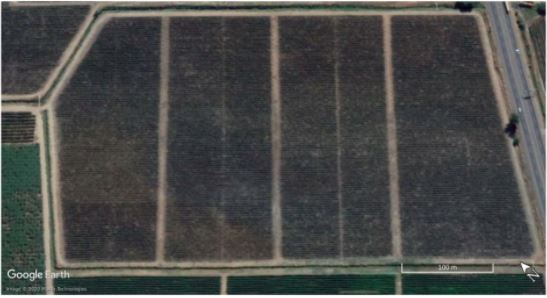
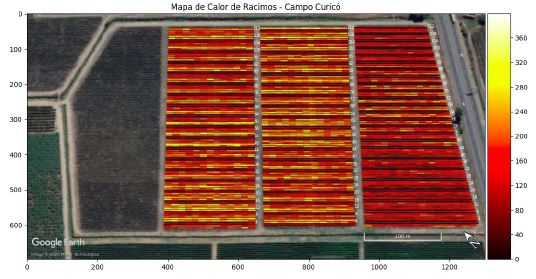
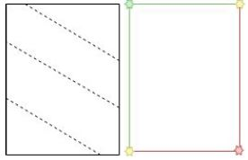
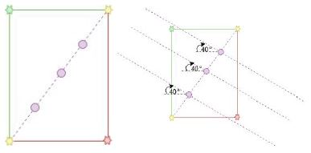
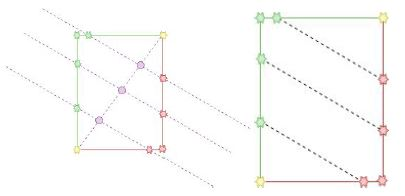

# Heat Maps from Pickles files

In this folder [heat_maps_generation] we can find everything realated to creation of pickles files for a vineyard. This pickles are created by fields and quarters.

First, we need the pickle files inside the folder [location_pickles], where every pickle has to be inside a subfolder of its respective field and quarter. The structure is the following:


```bash
Curico/
├── location_pickles/
│   ├── vinaSP_2_2
│   ├── vinaSP_2_3
│   └── vinaSP_2_4
|── prediction_pickles/
|── mega_pickle.pkl    
```

Here, vinaSP_2_2 represent a quarter in the Curico's field. The folder's name would be:
vinaSp_#field_#quarter

Inside the folder of each quarter, we need to place the pickle files that represent each rows of the quarter.
Then, the format will be:
locvinaSP_2_2_2_1.pkl
locvinaSP_#field_#quarter_#row_#time(am o pm).pkl

# Running
To generate the heat maps of a certain field, we need to use the following script with the following parameters:
[process_loc_pickles.py] --field path to the field's folder --img path to the satelital image of the field --megapk path to the mega_pickles.pkl of the field.

example: 
python process_loc_pickles.py --campo $LOCATION_PKL_DIR --img $SAT_IMG_DIR --megappk $MEGAPKL_DIR

To optimize the creation of heatmaps, we implement a bash script where the parameters above are variables of the script. The name of the bash script is [get_heatmaps.sh] and its excecution will be:

./get_heatmaps.sh


# HEATMAP
The code is inside the "codigo_heatMap" folder of "samples/uvas" in the nave grande. The dependencies are specified on `requirements.txt`. First, access to the virtual env: `source env/bin/activate`.  On the folder where the modules are, it also should be `mega_pikle.pkl`.

## How to use the code?

Suppose you want to plot a heat map for the second quarter (from the left) of the field shown in the figure below.



Go to the image, and extract the coordinates (in pixels), of the vertices of the polygon that encloses the quarter. Separate the coordinates into two lists. The first corresponds to the vertices of the sides where the rows begin. For this particular case, suppose that the rows start from the left side, then the first list corresponds to: `[(641,38),(402,38),(388,613)]`. The second list corresponds to: `[( 641 , 38 ) , ( 649 , 610 ) , ( 388 , 613 )]`. Note that the first and last point of this list coincide with the other list. This must always be true to close the polygon, even though in this case the vertex `(641 ,38)` does not belong to a side where a row begins nor (388, 613) to a side where a row ends (No row begins or ends on the upper and lower sides of the polygon). Luego, juntar ambas listas en una lista, como se ve a continuación:

    `[[(641,38),(402,38),(388,613)],[(641,38),(649,610),(388,613)]]`

As this is field 2 (Curicó) and we are working with the 2nd quarter of the field, I enter the identifier of the field to the dictionary `COORDINADAS_POLY` (only if it does not exist), of the module "process_loc_pickles.py", as a key with a dictionary value. For this dictionary, the key is the quarter ID with another dictionary as a value. Finally, this last dictionary contains information about the polygon. In this case `poly_verts` is the key in which we will save the previously generated list. On the other hand, `"diagonal"` is a list of two points that define a line from which I will generate the rows that I am going to draw. In this case, I choose as `"diagonal"` the list: `[(388, 613), (641, 38)]`. Note that this line must intersect all the rows of the quarter and the points must belong to `"poly_verts"`. Another key in the dictionary is `"hilera_angulo"`, this angle represents the orientation of the rows with respect to the horizontal in the image. In this case this angle corresponds to `0°`. Lastly, `“n_hileras”` is the key that indicates the number of rows that the barracks contains. This case is 112 rows. The structure of COORDINADAS_POLY after adding the data of this barracks is the one shown (assuming that it had no data):

    `COORDENADAS_POLY = { "2" :{ "2" :{ "poly_verts" :[[( 641 , 38 ) , ( 402 , 38 ) , ( 388 , 613 )] , [( 641 , 38 ) , ( 649 , 610 ) , ( 388 , 613 )]] ,"diagonal" :[( 388 , 613 ) , ( 641 , 38 )] , "hilera_angulo" : 0 , "n_hileras" : 112 }}}`

With this data entered and a folder with the corresponding `“location_pickles”`, you can draw the heat map on the figure. The folder where these pickles are must have a name in the format: `"<nombreCliente>_<campo>_<cuartel>"`. All folders in a barracks must be inside a folder with the name of the field. To draw the heatmap I run:

    `python3 process_loc_pickles.py --campo <path/a/la/carpeta/del/campo/> --img <path/a/la/imagen/satelital/del/campo>`

A result for the Curicó field is shown below:



### Hyperparameters:
Some hyperparameters were left to change the look of the heatmap that can be executed as arguments of the `process_loc_pickles.py` module:
- **--area:** despliega suma de las areas de cada racimo por segmento de hilera en vez de solo el conteo
- **--delta_h:** Cambia el tamaño de los intervalos de cada hilera
- **--linewidth:** Cambia el grosor de cada hilera
- **--boundary:** El límite máximo de conteo en cada intervalo de cada hilera. Controla a la larga la distinción entre los conteos de cada parte del mapa.

### What does start_end_points do:

This module finds the start and end points of each row according to the exemplary process below. Suppose we have the polygon of a quarter where the dotted lines represent the rows, like the figure below on the left. We have information in POLY_COORDINATES such as the vertices of the polygon in "poly_verts" separated by where the rows begin (green and yellow points) and where the rows end (red and yellow points), as seen in the figure below on the right.

 

We also have "diagonal", which we can segment by "n_hileras", in this case 3, as seen below in the figure at the bottom left. From the points (purple) that are generated here, we can build lines with an angle defined by “hilera_angulo”, as shown below right.

 

Based on these lines, we can find the intersections with each side of the polygon, as shown below left. We associate each intersection with the starting side of the row or end side. Then we can build the rows using these points, as shown in the figure at the bottom right.

 

### TODO HEATMAP

- There is a part that performs the extraction of frame limits, for binning, based on the maximum and minimum of the frame lists in the row. This is not necessarily true, since at the beginning or end of the video there may be no camera movement and therefore impairs the accuracy of the location of the bunchs densities in the row. Hardcode the number of frames where the camera movement begins and ends in each video and working with those is more precise.

- Determining if the sum of the am and pm counts is indeed the best operation to reflect the number of bunches actually present in the row.

- Both am and pm counting videos are assumed to start from the same place in the row. This is the beginning or the end, although it is not necessarily true. **It remains to include the orientation to the name of each pickle to determine in which sense of the lists counts_am and counts_pm the counts have to be combined. This means that the heatMaps generated for now do not reflect the cluster distribution in a row properly.**
